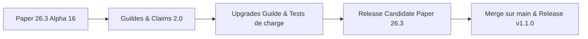

# Suivi & Feuille de route Paper 26.3

Suivez en temps réel l'avancée des travaux, les améliorations apportées et la feuille de route de **GensCore** pour **Minecraft 26.3** et **Java 25 LTS**.

::: info Statut du Projet
- **Version cible :** Minecraft 26.3 (Paper Build Alpha 16+)
- **Environnement d'exécution :** Java 25 LTS
- **Branche de travail active :** [`dev`](https://github.com/WilliamBossard/GensCore/tree/dev) & [`main`](https://github.com/WilliamBossard/GensCore/tree/main)
- **Stabilité :** Alpha fonctionnelle avancée en environnement de production / test
:::

---

## Tableau de bord d'avancement

| Composant | Statut | Détails |
| :--- | :---: | :--- |
| **Compatibilité Java 25 LTS** | Terminé | Compilé avec le flag `--release 25` et tests JVM réussis |
| **API Paper 26.3** | Terminé | API mise à jour sur `26.3.build.16-alpha` |
| **Quêtes de Craft (Torches & Multi-craft)** | Terminé | Prise en compte exacte du rendement unitaire vanilla et du shift-click |
| **Boutique Complète (319 Objets & Potions)** | Terminé | 7 catégories, prix équilibrés (marge 25-35%), auto-seeding SQLite & pagination |
| **Remaster Mini-Jeux Web & CoinFlip** | Terminé | RTP Casino ramené à 84%, nouveau jeu CoinFlip 3D, switch admin en direct |
| **Internationalisation (FR & EN)** | Terminé | Traduction intégrale in-game et web de tous les modules |
| **Moteur Brigadier Paper** | Terminé | Migration vers `PaperCommandManager` avec Tab-completion native |
| **Cloud Reflection Patch** | Terminé | Neutralisation du crash `ItemStackParser` lors du boot |
| **Anti Double-Clic Shop** | Terminé | Debounce 500ms par joueur dans le `CustomGuiModule` |
| **Sync Bannissements** | Terminé | Synchronisation SQLite ⟷ `banned-players.json` natif |
| **Crossplay Bedrock (Geyser/Floodgate)** | Blindé | Capture des `Throwable` et isolation Cumulus/Floodgate face aux changements de bytecode 26.3 |
| **Validation Folia Régionale** | Terminé | Élimination de `isPrimaryThread`, callbacks de téléportation asynchrone et décomposition cross-region |
| **Système de Guildes & Claims 2.0** | Terminé | Anti-grief total, titres frontaliers écran, rôles Admin, gestion web et BlueMap |
| **Nouvelles Améliorations de Guilde** | Planifié | Foyer de Guilde, Aura de Territoire, Intérêts Bancaires, Boost Spawners, Coffre-fort |

---

## Ce qui a été fait (Modifications récentes)

### 1. Correction du comptage des quêtes de craft (Shift-Click)
* **Problème résolu :** Crafter des lots d'items (par ex. 32 torches en shift-click) ne comptabilisait que 8 items, car l'événement ne rapportait que la quantité brute d'une unité de recette.
* **Correction apportée :** Détection intelligente du nombre maximal d'exécutions possibles dans la matrice de craft (`minIngredients`), bornée par la place restante dans l'inventaire du joueur, et multiplication par le rendement par craft (`yieldPerCraft = 4` pour les torches).

### 2. Boutique survie prête à l'emploi (319 items & Alchimie)
* **Contenu par défaut :** 319 items validés selon les standards de Minecraft 26.3 répartis en 7 catégories claires (`ores`, `farming`, `wood` avec le nouveau Pale Oak, `building`, `mob_drops`, `potions`, `utilities`).
* **Économie anti-abus :** Prix de vente fixés à ~25-35% du prix d'achat, interdisant toute duplication d'argent par rachat/vente ou arbitrages quêtes/métiers.
* **Moteur dynamique :** Auto-seeding automatique dans SQLite au premier lancement si les tables sont vides, pagination GUI de 45 objets par page avec flèches de navigation, et commande `/shop reload`.

### 3. Remaster des Mini-Jeux Web & Nouveau Jeu CoinFlip
* **Rééquilibrage Casino (Machine à sous) :** Le RTP théorique a été ramené à un taux sain de **84%** (4% Jackpot ×5, 8% Gain moyen ×3, 20% Petit gain ×2, 68% Perte), éliminant les abus de duplication de ressources rares.
* **Roue de la fortune :** 8 tranches équiprobables normalisées à 100%.
* **CoinFlip (Pile ou Face) :** Mini-jeu 3D interactif avec rotation de pièce, payout à x1.95, et contrôle en temps réel via le panneau administrateur.

### 4. Résolution du crash au démarrage sur Paper 26.3
* **Problème identifié :** Lors de l'initialisation de `PaperCommandManager`, la bibliothèque sous-jacente Cloud Framework invoquait une classe de réflexion interne (`ItemStackParser$ModernParser`) cherchant les méthodes `asBukkitCopy` et `asCraftMirror` sur les classes internes NMS de Mojang, dont la signature a évolué en 26.3, provoquant un `ExceptionInInitializerError`.
* **Solution apportée :** Remplacement ciblé de la classe `ItemStackParser` dans les sources compilées avec un mécanisme de détection sécurisé et un repli automatique vers `LegacyParser` (100% Bukkit API standard sans injection NMS). Le plugin démarre désormais sans la moindre erreur sur Paper 26.3.

### 5. Système de Guildes, Territoires (Claims) & Rôles Administrateur
* **Hiérarchie et délégation :** Implémentation complète du rôle **Administrateur (`ADMIN`)** en complément du **Chef (`LEADER`)** et des **Membres (`MEMBER`)**. Les administrateurs peuvent inviter, expulser des membres réguliers, revendiquer des claims, effectuer des retraits bancaires et acheter des améliorations.
* **Sécurité territoriale & Anti-Grief :** Protection absolue des chunks revendiqués ($16 \times 16$). Blocage de la casse/pose, accès coffres/barils/fours/shulkers/entonnoirs, interactions redstone (portes, boutons, leviers), dégâts aux entités passives/porte-armures et interdiction des pistons traversant les bordures.
* **Affichage frontalier immersif :** Envoi d'un Titre et Sous-titre animés à l'écran du joueur avec effet sonore lorsqu'il pénètre dans un territoire revendiqué par une guilde.
* **Gestion complète Portail Web :** Interface de gestion en ligne permettant de promouvoir des administrateurs, rétrograder ou expulser des membres (avec modale de confirmation), personnaliser la couleur BlueMap en temps réel et acheter des améliorations d'équipe.
* **Auto-mise à jour du Panel Web :** Détection automatique au démarrage des versions plus récentes d'assets web dans le JAR pour une extraction transparente dans `plugins/GensCore/web/`.

---

## Ce qui est en cours de travail

### 1. Nouvelles Améliorations de Guilde (En cours d'implémentation)
* **Foyer de Guilde (`GUILD_HOME`) :** Point de téléportation partagé avec réduction progressive du délai de téléportation et du cooldown.
* **Aura de Territoire (`TERRITORY_BUFF`) :** Effets de potions passifs au sein des claims (Régénération, Vitesse, Célérité).
* **Intérêts Bancaires Journaliers (`BANK_INTEREST`) :** Dividendes passifs calculés sur le solde de la trésorerie de guilde chaque 24 heures réelles.
* **Surcadençage des Spawners (`SPAWNER_EFFICIENCY`) :** Vitesse de spawn et taux de drops augmentés pour les générateurs installés en territoire de guilde.
* **Coffre-fort Virtuel Partagé (`GUILD_VAULT`) :** Inventaire sécurisé partagé (9 à 54 slots) accessible in-game et via le portail web.

### 2. Suivi des mises à jour GeyserMC & Floodgate
* Geyser a mis à disposition un build compatible avec le protocole réseau 26.3 (`2.11.3-SNAPSHOT`).
* Floodgate fonctionne sans mise à jour immédiate obligatoire pour la vérification des clés de chiffrement Bedrock, mais des tests de validation approfondis sur les formulaires Cumulus et la transmission des skins sont en cours de réalisation.

### 3. Validation continue des 28 modules intégrés
* Tests d'intégration progressifs de chaque module sous Paper 26.3 :
  - Métiers & Économie (Jobs, Shop, Auction House)
  - Sécurité & Anti-Exploit (Verrouillage coffres/shulkers, anti-duplication)
  - Mini-jeux & Événements (Pinata, Boss bar, Loterie, CoinFlip)
  - Bot Discord & Serveur Web Javalin 7.2

---

## Feuille de route (Prochaines étapes)

1. **Phase 1 (Actuelle) :** Système de Guildes 2.0 terminé (Claims anti-grief, BlueMap, rôles Admin, portail web).
2. **Phase 2 :** Intégration des nouvelles améliorations de guilde (Foyer, Aura, Intérêts, Spawners, Coffre-fort).
3. **Phase 3 :** Tests de charge et validation Folia multi-régions (50+ joueurs avec Spark).
4. **Phase 4 :** Sortie de la Release Candidate (RC) Paper 26.3.
5. **Phase 5 :** Fusion sur la branche `main` et publication du package officiel GensCore v1.1.0.

---

## Historique des patchs récents

### Patch 26.3-alpha.18 (18 Septembre 2026)
- **Rôles & Hiérarchie de Guilde :** Ajout complet du rôle `ADMIN` dans la base SQLite (`genscore_team_members.role`), commandes `/team promote`, `/team demote`, `/team kick`, `/team leave`, `/team disband` et interaction dans l'interface `/team` (clic gauche promote/demote, clic droit kick).
- **Protection Anti-Grief Complète des Claims :** Sécurisation totale des parcelles de guilde contre la casse/pose, ouverture de coffres, barils, fours, shulkers, entonnoirs, redstone, attaques d'animaux/porte-armures et pistons inter-chunks.
- **Titres Écran Frontaliers :** Envoi d'un titre et sous-titre traduits avec effet sonore lors du franchissement des frontières d'un territoire revendiqué.
- **Portail Web Guilde Étendu :** Nouveaux boutons d'administration des membres (promotion Admin, rétrogradation, expulsion avec modale de confirmation), gestion en ligne de la trésorerie ($/XP), personnalisation de la couleur BlueMap et achats d'upgrades.
- **Auto-Sync Assets Web :** Mise à jour automatique des assets web de `plugins/GensCore/web/` dès l'installation d'une nouvelle version du JAR sans nécessiter de suppression manuelle.

### Patch 26.3-alpha.17 (18 Septembre 2026)
- **Garde-fou Anti-Arbitrage Boutique :** Harmonisation de l'exposant d'inflation dynamique dans `ShopItem` avec `GLOBAL_INFLATION_EXPONENT` et instauration d'un plafond de marge strict interdisant au prix de vente de dépasser 75% du prix d'achat, éliminant tout risque de boucle infinie de duplication de monnaie.
- **Sécurisation des Nombres Flottants :** Validation systématique avec `Double.isFinite()` sur les commandes d'économie et d'hôtel des ventes (`/pay`, `/eco`, `/ah sell`) bloquant les injections de charges utiles `NaN` et `Infinity`.
- **Write-Behind Cache SQLite (Économie) :** Remplacement des micro-écritures asynchrones isolées par une sauvegarde groupée périodique par lots (`flushDirtyBalances()` toutes les 10 secondes), prévenant les régressions d'état désordonnées en base de données.
- **Thread-Safety du Module Loot :** Synchronisation des instances `YamlConfiguration` dans `LootManager` pour éliminer les corruptions de fichiers lors de sauvegardes asynchrones concurrentes sur Folia.
- **Arrêt JDA Non Bloquant :** Remplacement du délai figé `Thread.sleep(1500)` dans `DiscordModule` par `jda.awaitShutdown(Duration.ofMillis(1500))` avec bascule gracieuse sur `shutdownNow()`.
- **Suite de Tests Automatisés Élargie :** Intégration de JUnit 5 (`junit-jupiter:5.12.0`) et Surefire, avec déploiement d'une suite complète de 38 tests unitaires couvrant l'anti-arbitrage du shop, la validation financière, la sérialisation Base64, l'assainissement des formulaires Bedrock, le calcul de batch des quêtes de craft, la simulation Monte-Carlo du Casino Web (RTP 84%), l'authentification BCrypt et la persistance SQLite par lots avec un taux de réussite de 100% (38/38).

### Patch 26.3-alpha.16 (18 Septembre 2026)
- **API Paper :** Mise à niveau vers `26.3.build.16-alpha` (dernière build officielle PaperMC).
- **Porte-monnaie & Solde en direct :** Intégration d'un widget de solde d'argent en temps réel sous le profil joueur (sidebar) avec animations de variation (crédit vert `+XX.XX $` et débit rouge `-XX.XX $`) et rafraîchissement au clic.
- **Boutique & Sécurité Achat :** Affichage du solde restant calculé en direct dans le tiroir d'achat, avec bandeau d'alerte et blocage automatique de l'achat en cas de solde insuffisant.
- **Assets & Textures Minecraft 26.3 :** Prise en charge à 100% des 1 815 matériaux Bukkit modernes (Lances/Spears vanilla, set de Peuplier/Poplar, 16 coussins, champignon sur étagère, lits de paille, statues et coffres en cuivre) avec double repli intelligent en cas d'asset indisponible.
- **Workflow CI/CD :** Mise à jour des métadonnées de release GitHub pour cibler `Paper 26.3.build.16-alpha`.

### Patch 26.3-alpha.8 (17 Septembre 2026)
- **API Paper :** Mise à jour vers `26.3.build.8-alpha`.
- **Quêtes de Craft :** Résolution du bug de Shift-Click et prise en compte du rendement batch vanilla (32 torches comptabilisées).
- **Boutique :** Configuration intégrale de 319 objets vanilla (ores, farming, wood avec Pale Oak, building, mob drops, potions, utilities), marge 25-35%, auto-seeding SQLite et pagination GUI 45 slots.
- **Mini-Jeux Web :** Rééquilibrage machine à sous à 84% RTP, roue normalisée, ajout du jeu CoinFlip 3D et interrupteur admin web.
- **Traductions :** Prise en charge intégrale bilingue FR/EN in-game et web.

### Patch 26.3-alpha.7 (16 Septembre 2026)
- **Compatibilité Folia :** Résolution du crash provoqué par `Bukkit.isPrimaryThread()` dans `EconomyModule`, assurant des transactions 100% thread-safe sur les schedulers régionaux Folia.
- **Résilience Geyser / Floodgate :** Blindage de `BedrockSkinModule` et `BedrockFormManager` avec capture de `Throwable` pour neutraliser les `LinkageError` et `NoClassDefFoundError` durant la transition vers 26.3.
- **Initialisation BDD Dynamique :** Correction de `ModuleManager` pour garantir l'exécution de `initDatabase()` lors de l'activation à chaud d'un module en jeu ou via le panel Web.
- **Téléportation Asynchrone :** Prise en compte du callback `CompletableFuture<Boolean>` dans `TeleportUtil` pour confirmer le déplacement effectif du joueur.
- **Workflow CI/CD :** Spécification exacte de `Paper 26.3.build.6-alpha` et de la compatibilité de branche dans les métadonnées de release GitHub.

### Patch 26.3-alpha.6 (16 Septembre 2026)
- **Paper API :** Mise à niveau vers l'API Paper `26.3.build.6-alpha`.
- **Web Panel :** Masquage automatique de l'entrée « Mini-Jeux » dans la navigation joueur lorsque le module ou l'ensemble des jeux sont désactivés.
- **Web Panel :** Redirection immédiate vers le tableau de bord principal en cas de tentative d'accès direct à une route de jeu désactivée.
- **Traductions :** Ajout de la description française et anglaise du module `bedrockskin` et sécurisation des clés de traduction.
