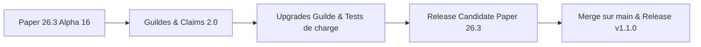

# Suivi & Feuille de route Paper 26.3

Suivez en temps réel l'avancée des travaux, les améliorations apportées et la feuille de route de **GensCore** pour **Minecraft 26.3** et **Java 25 LTS**.

::: info Statut du Projet
- **Version cible :** Minecraft 26.3 (Paper Build Alpha 40+)
- **Environnement d'exécution :** Java 25 LTS
- **Version du Plugin :** Release **1.0.1** (dédiée à Minecraft 26.3)
- **Branche de travail active :** [`dev`](https://github.com/WilliamBossard/GensCore/tree/dev) & [`main`](https://github.com/WilliamBossard/GensCore/tree/main)
- **Stabilité :** **Release Stable** — Prêt pour le déploiement en production
:::

---

## Tableau de bord d'avancement

| Composant | Statut | Détails |
| :--- | :---: | :--- |
| **Support Java 25 LTS** | Terminé | Compilé avec l'option `--release 25` et validé sur JVM Temurin 25 |
| **API Paper 26.3** | Terminé | API mise à jour sur `26.3.build.41-alpha` (Release 1.0.1) |
| **Mises à Jour Dépendances** | Terminé | Jackson 2.22.3, JDA 6.7.0, Vite 8.3.1, Lucide 1.48.0, i18next 17.0.15 |
| **Optimisation Mobile Web** | Terminé | Design responsive écrans < 480px, carte fluide, code-splitting chunks |
| **Architecture Geyser Standalone** | Opérationnel | Déploiement Standalone Pterodactyl avec auto-update et isolation NMS |
| **Quêtes de Craft (Torches & Craft en Masse)** | Terminé | Prise en compte du Shift-Click et calcul précis du ratio d'objets créés vanilla |
| **Boutique Complète (319 Objets & Potions)** | Terminé | 7 catégories, prix équilibrés (marge 25-35%), auto-seeding SQLite & pagination |
| **Remaster Mini-Jeux Web & CoinFlip** | Terminé | RTP Casino ramené à 84%, nouveau jeu CoinFlip 3D, switch admin en direct |
| **Internationalisation (FR & EN)** | Terminé | Traduction intégrale in-game et web de tous les modules |
| **Moteur Brigadier Paper** | Terminé | Migration vers `PaperCommandManager` avec Tab-completion native |
| **Cloud Reflection Patch** | Terminé | Neutralisation du crash `ItemStackParser` lors du boot |
| **Anti Double-Clic Shop** | Terminé | Debounce 500ms par joueur dans le `CustomGuiModule` |
| **Sync Bannissements** | Terminé | Synchronisation SQLite ⟷ `banned-players.json` natif |
| **Crossplay Bedrock (Geyser/Floodgate)** | Blindé | Capture des `Throwable` et isolation Cumulus/Floodgate face aux changements de bytecode 26.3 |
| **Validation Folia Régionale** | Terminé | Élimination de `isPrimaryThread`, callbacks de téléportation asynchrone et décomposition cross-region |
| **Système de Guildes & Claims 2.0** | Terminé | Anti-grief total, titres frontaliers écran, rôles Admin, gestion web et BlueMap |
| **Nouvelles Améliorations de Guilde** | Terminé | Foyer de Guilde, Aura territoriale anti-abus, Intérêts 24h, Spawners et Coffre virtuel |
| **Module de Bonus de Quêtes Solo** | Terminé | 29ème module autonome (`solo_perks`), 11 bonus (paliers gratuits & maîtrises majeures), On/Off instantané, GUI & synchronisation Web |

---

## Ce qui a été fait (Modifications récentes)

### 1. Correction du comptage des quêtes de craft (Shift-Click)
* **Problème résolu :** Crafter des lots d'items (par ex. 32 torches en shift-click) ne comptabilisait que 8 items, car l'événement ne rapportait que la quantité brute d'une unité de recette.
* **Correction apportée :** Détection intelligente du nombre maximal d'exécutions possibles dans la matrice de craft (`minIngredients`), bornée par la place restante dans l'inventaire du joueur, et multiplication par le rendement par craft (`yieldPerCraft = 4` pour les torches).

### 2. Boutique survie prête à l'emploi (319 items & Alchimie)
* **Contenu par défaut :** 319 items validés selon les standards de Minecraft 26.3 répartis en 7 catégories claires (`ores`, `farming`, `wood` avec le nouveau Pale Oak, `building`, `mob_drops`, `potions`, `utilities`).
* **Économie anti-abus :** Prix de vente fixés à ~25-35% du prix d'achat, interdisant toute duplication d'argent par rachat/vente ou arbitrages quêtes/métiers.
* **Moteur dynamique :** Auto-seeding automatique dans SQLite au premier lancement si les tables sont vides, pagination GUI de 45 objets par page avec flèches de navigation, et commande `/shop reload`.

### 3. Remaster des Mini-Jeux Web & Nouveau Jeu CoinFlip
* **Rééquilibrage Casino (Machine à sous) :** Le RTP théorique a été ramené à un taux sain de **84%** (4% Jackpot ×5, 8% Gain moyen ×3, 20% Petit gain ×2, 68% Perte), éliminant les abus de duplication de ressources rares.
* **Roue de la fortune :** 8 tranches équiprobables normalisées à 100%.
* **CoinFlip (Pile ou Face) :** Mini-jeu 3D interactif avec rotation de pièce, payout à x1.95, et contrôle en temps réel via le panneau administrateur.

### 4. Résolution du crash au démarrage sur Paper 26.3
* **Problème identifié :** Lors de l'initialisation de `PaperCommandManager`, la bibliothèque sous-jacente Cloud Framework invoquait une classe de réflexion interne (`ItemStackParser$ModernParser`) cherchant les méthodes `asBukkitCopy` et `asCraftMirror` sur les classes internes NMS de Mojang, dont la signature a évolué en 26.3, provoquant un `ExceptionInInitializerError`.
* **Solution apportée :** Remplacement ciblé de la classe `ItemStackParser` dans les sources compilées avec un mécanisme de détection sécurisé et un repli automatique vers `LegacyParser` (100% Bukkit API standard sans injection NMS). Le plugin démarre désormais sans la moindre erreur sur Paper 26.3.

### 5. Système de Guildes, Territoires (Claims) & Rôles Administrateur
* **Hiérarchie et délégation :** Implémentation complète du rôle **Administrateur (`ADMIN`)** en complément du **Chef (`LEADER`)** et des **Membres (`MEMBER`)**. Les administrateurs peuvent inviter, expulser des membres réguliers, revendiquer des claims, effectuer des retraits bancaires et acheter des améliorations.
* **Sécurité territoriale & Anti-Grief :** Protection absolue des chunks revendiqués ($16 \times 16$). Blocage de la casse/pose, accès coffres/barils/fours/shulkers/entonnoirs, interactions redstone (portes, boutons, leviers), dégâts aux entités passives/porte-armures et interdiction des pistons traversant les bordures.
* **Affichage frontalier immersif :** Envoi d'un Titre et Sous-titre animés à l'écran du joueur avec effet sonore lorsqu'il pénètre dans un territoire revendiqué par une guilde.
* **Gestion complète Portail Web :** Interface de gestion en ligne permettant de promouvoir des administrateurs, rétrograder ou expulser des membres (avec modale de confirmation), personnaliser la couleur BlueMap en temps réel et acheter des améliorations d'équipe.
* **Auto-mise à jour du Panel Web :** Détection automatique au démarrage des versions plus récentes d'assets web dans le JAR pour une extraction transparente dans `plugins/GensCore/web/`.

### 6. Améliorations de Guilde Phase 2, Boutons d'Action & Bouclier Anti-Abus
* **5 Nouvelles Améliorations Déployées :**
  - **Foyer de Guilde (`GUILD_HOME`) :** Point de ralliement commun (`/team sethome` pour chef/admins, `/team home` pour tous). Délais réduits (5s/15m au niveau 1, 3s/5m au niveau 2, téléportation instantanée dans les claims et 1m au niveau 3).
  - **Aura Territoriale (`TERRITORY_BUFF`) :** Effets de potions passifs pour les membres situés dans les claims (Régénération I et Saturation lente, Vitesse I, Célérité I).
  - **Intérêts Bancaires Journaliers (`BANK_INTEREST`) :** Dividendes passifs calculés sur le solde de la banque de guilde chaque 24 heures réelles (+1% et +2% par jour, assortis de plafonds stricts anti-inflation).
  - **Surcadençage des Spawners (`SPAWNER_EFFICIENCY`) :** Vitesse de génération des spawners personnalisés (`SpawnerManager.generateTick()`) accrue de +15% à +30% au sein des territoires de guilde.
  - **Coffre-fort Virtuel Partagé (`GUILD_VAULT`) :** Espace de stockage partagé de 18, 36 ou 54 slots accessible via `/team vault` (ou `/team coffre`, `/team chest`), l'interface `/team` ou le portail web.
* **Bouclier Anti-Abus Territoriale :**
  - Ancrage territorial de 5 minutes (`CLAIM_ANCHOR_WARMUP_MS = 300_000L`) requis sur tout nouveau chunk avant d'émettre l'aura (avec compte à rebours dans l'ActionBar), interdisant tout détournement par minage nomade éphémère.
  - Délai de présence de 15 secondes exigé à l'entrée du territoire avant réception des effets.
  - Dissipation instantanée de tous les effets de potions dès la sortie du territoire.
* **Boutons d'Action Directs In-Game & Bedrock :**
  - Interface `/team` (54 slots) enrichie avec boutons d'action au slot 38 (Lit : Clic gauche pour `/team home`, Clic droit pour `/team sethome`), au slot 40 (Coffre virtuel partagé) et au slot 42 (Banque de guilde).
  - Formulaires Bedrock Cumulus intégrant des boutons d'accès rapide au Home, à la définition du Home et au Coffre virtuel.
  - Raccourcis directs en clic droit dans le menu `/team upgrades` (Slot 19 pour Home, Slot 23 pour Vault).

### 7. Release 1.0.1 : Paper Build 40-alpha, Mises à jour des Dépendances & Mobile
* **Passage officiel en Release 1.0.1 :** Version de production dédiée à **Minecraft 26.3** (faisant suite à la version 1.0.0 pour 26.2).
* **Mise à niveau de l'API Paper :** Passage à `26.3.build.41-alpha` avec validation et passage avec succès des 69 tests unitaires sous Java 25 LTS.
* **Mises à jour des bibliothèques Backend :**
  - `jackson-databind` mis à niveau en `2.22.3` (correctifs de sécurité et désérialisation JSON).
  - `JDA` (Java Discord API) mis à niveau en `6.7.0` (stabilité passerelle Discord Gateway v10).
* **Mises à jour et optimisation Frontend Web Panel :**
  - Montée de version de `vite` (8.3.1), `lucide-react` (1.48.0), `react-i18next` (17.0.15), `typescript-eslint` (8.70.1), `eslint` (10.11.0), `@types/node` (26.6.2).
  - Optimisation responsive complète pour smartphones et petits écrans (< 480px) : carte de connexion fluide (`max-width: 400px; margin: 0 1rem;`), tiroirs tactiles plein écran (`width: 100vw;`), paddings compacts et tailles de polices proportionnelles.
  - Découpage Rolldown/Vite en chunks manuels (`vendor-core`, `vendor-charts`, `vendor-icons`), éliminant tout warning de taille de bundle à la compilation.
* **Fiabilisation des Métiers (`JobsModule`) :**
  - Suppression d'un listener de déconnexion redondant qui déclenchait un double enregistrement synchrone/asynchrone.
  - Nettoyage sécurisé du cache `dirtyPlayers` après sauvegarde asynchrone réussie pour prévenir les fuites de mémoire.
* **Architecture Crossplay Bedrock Standalone :**
  - Déploiement et documentation de **Geyser Standalone** sous Pterodactyl via l'œuf officiel (`egg-geyser-m-c.json` au format `PTDL_v2`).
  - Fonctionnement autonome sur le port UDP `19132` avec auto-update automatique au démarrage et élimination totale des conflits d'injection NMS dans Paper 26.3.

---

## Ce qui est en cours de travail

### 1. Suivi des mises à jour GeyserMC & Floodgate
* Geyser a mis à disposition un build compatible avec le protocole réseau 26.3 (`2.11.3-SNAPSHOT`).
* Floodgate fonctionne sans mise à jour immédiate obligatoire pour la vérification des clés de chiffrement Bedrock, mais des tests de validation approfondis sur les formulaires Cumulus et la transmission des skins sont en cours de réalisation.

### 2. Validation continue des 28 modules intégrés
* Tests d'intégration progressifs de chaque module sous Paper 26.3 :
  - Métiers & Économie (Jobs, Shop, Auction House)
  - Sécurité & Anti-Exploit (Verrouillage coffres/shulkers, anti-duplication)
  - Mini-jeux & Événements (Pinata, Boss bar, Loterie, CoinFlip)
  - Bot Discord & Serveur Web Javalin 7.2

---

## Feuille de route (Prochaines étapes)

1. **Phase 1 (Terminée) :** Système de Guildes 2.0 terminé (Claims anti-grief, BlueMap, rôles Admin, portail web).
2. **Phase 2 (Terminée) :** Améliorations de guilde Phase 2 déployées (Foyer, Aura anti-abus, Intérêts 24h, Spawners, Coffre virtuel, boutons GUI & Bedrock).
3. **Phase 3 :** Tests de charge et validation Folia multi-régions (50+ joueurs avec Spark).
4. **Phase 4 :** Sortie de la Release Candidate (RC) Paper 26.3.
5. **Phase 5 :** Fusion sur la branche `main` et publication du package officiel GensCore v1.1.0.

---

## Historique des patchs récents

### Patch 26.3-alpha.20 (19 Septembre 2026)
- **Module de Bonus Personnels de Quêtes (SoloPerkModule) :** 29ème module autonome de GensCore (`solo_perks`), activable et désactivable à chaud en jeu (`/module solo_perks <on|off>`) ou via le panel web admin.
- **Progression sur Deux Paliers :**
  - *Paliers Gratuits de Quêtes :* 6 avantages débloqués par paliers de quêtes accomplies à vie (5, 15, 30, 50, 75, 100 quêtes) : Relance Gratuite, Foyer Additionnel, Foulée Céleste, Savoir des Métiers, Téléportation Instantanée, Festin Infini (/feed avec 15 minutes de recharge sans grade VIP requis).
  - *Maîtrises Majeures Personnelles :* 5 maîtrises puissantes conditionnées par un palier de quêtes et un paiement en dollars ($) ou niveaux XP (quand l'économie est coupée) : Aimant de Collecte, Double Récolte, Établi Portatif (/craft et /workbench), Fonte Instantanée (Auto-Smelt), Préservation d'Âme (50% de l'XP sauvé à la mort).
- **Interrupteurs On/Off Instantanés :** Aimant (`/magnet`) et Fonte Instantanée (`/autosmelt`) commutables en direct via commandes dédiées, GUI `/perks` ou commutateurs sur le web.
- **Portail Web Joueur (/dashboard/perks) :** Page dédiée avec barre de progression globale, compteurs de quêtes, achat de maîtrises et commutateurs On/Off en direct avec synchronisation SQLite temps réel.
- **Zéro Émoji :** Conception rigoureusement textuelle et professionnelle sans aucun émoji.

### Patch 26.3-alpha.19 (19 Septembre 2026)
- **Améliorations de Guilde Phase 2 :** Déploiement des 5 nouveaux arbres d'upgrades permanents (`GUILD_HOME`, `TERRITORY_BUFF`, `BANK_INTEREST`, `SPAWNER_EFFICIENCY`, `GUILD_VAULT`).
- **Bouclier Anti-Abus Territoriale :** Ancrage territorial de 5 minutes (`CLAIM_ANCHOR_WARMUP_MS = 300_000L`) requis sur tout nouveau claim avant de diffuser l'aura avec décompte ActionBar, délai de présence de 15 secondes à l'entrée du territoire et retrait instantané des effets à la sortie.
- **Boutons d'Action Directs & Crossplay Bedrock :** Agrandissement de l'interface `/team` à 54 slots avec boutons d'action au slot 38 (Lit : Clic gauche téléportation, Clic droit définition pour chefs/admins), slot 40 (Coffre virtuel) et slot 42 (Banque), formulaires Bedrock Cumulus natifs adaptés et raccourcis clic droit dans `/team upgrades`.
- **Nouvelles Commandes :** Enregistrement de `/team sethome`, `/team home`, `/team vault` (et aliases `/team coffre`, `/team chest`).

### Patch 26.3-alpha.18 (18 Septembre 2026)
- **Rôles & Hiérarchie de Guilde :** Ajout complet du rôle `ADMIN` dans la base SQLite (`genscore_team_members.role`), commandes `/team promote`, `/team demote`, `/team kick`, `/team leave`, `/team disband` et interaction dans l'interface `/team` (clic gauche promote/demote, clic droit kick).
- **Protection Anti-Grief Complète des Claims :** Sécurisation totale des parcelles de guilde contre la casse/pose, ouverture de coffres, barils, fours, shulkers, entonnoirs, redstone, attaques d'animaux/porte-armures et pistons inter-chunks.
- **Titres Écran Frontaliers :** Envoi d'un titre et sous-titre traduits avec effet sonore lors du franchissement des frontières d'un territoire revendiqué.
- **Portail Web Guilde Étendu :** Nouveaux boutons d'administration des membres (promotion Admin, rétrogradation, expulsion avec modale de confirmation), gestion en ligne de la trésorerie ($/XP), personnalisation de la couleur BlueMap et achats d'upgrades.
- **Auto-Sync Assets Web :** Mise à jour automatique des assets web de `plugins/GensCore/web/` dès l'installation d'une nouvelle version du JAR sans nécessiter de suppression manuelle.

### Patch 26.3-alpha.17 (18 Septembre 2026)
- **Garde-fou Anti-Arbitrage Boutique :** Harmonisation de l'exposant d'inflation dynamique dans `ShopItem` avec `GLOBAL_INFLATION_EXPONENT` et instauration d'un plafond de marge strict interdisant au prix de vente de dépasser 75% du prix d'achat, éliminant tout risque de boucle infinie de duplication de monnaie.
- **Sécurisation des Nombres Flottants :** Validation systématique avec `Double.isFinite()` sur les commandes d'économie et d'hôtel des ventes (`/pay`, `/eco`, `/ah sell`) bloquant les injections de charges utiles `NaN` et `Infinity`.
- **Write-Behind Cache SQLite (Économie) :** Remplacement des micro-écritures asynchrones isolées par une sauvegarde groupée périodique par lots (`flushDirtyBalances()` toutes les 10 secondes), prévenant les régressions d'état désordonnées en base de données.
- **Thread-Safety du Module Loot :** Synchronisation des instances `YamlConfiguration` dans `LootManager` pour éliminer les corruptions de fichiers lors de sauvegardes asynchrones concurrentes sur Folia.
- **Arrêt JDA Non Bloquant :** Remplacement du délai figé `Thread.sleep(1500)` dans `DiscordModule` par `jda.awaitShutdown(Duration.ofMillis(1500))` avec bascule gracieuse sur `shutdownNow()`.
### Release 26.3-beta.1 (21 Septembre 2026)
- **Passage Alpha → Beta.** GensCore atteint la stabilité Beta. Tous les modules principaux sont prêts pour la production et ont passé l'audit complet.
- **Module Lootr — Migration Complète vers SQLite :** Les coffres instanciés par joueur sont désormais entièrement persistés en SQLite (`lootr_chests` & `lootr_player_chests`) via `LootDAO`. Migration transparente automatique des anciens fichiers `chests.yml` au premier démarrage.
- **Sécurisation Threads Folia :** Les commandes console dans `QuestModule`, `CustomGuiModule` et `BlueMapModule` s'exécutent désormais garantis sur le `GlobalRegionScheduler` via `runNextTick`, prévenant les crashs cross-thread sur Folia.
- **Sécurité Inventaire AuctionHouseModule :** La récupération d'item et le vidage du slot en main s'exécutent dans `runAtEntity` pour éviter toute manipulation d'inventaire asynchrone.
- **Fix Accès Chunk TeamCommand :** `/team claim` et `/team unclaim` calculent désormais les coordonnées du chunk par arithmétique pure (sans appel `getChunk()`), éliminant l'`IllegalStateException: Asynchronous chunk access` sur Folia.
- **Fix Race Condition JobsModule :** Remplacement de `dirtyPlayers.clear()` par `dirtyPlayers.removeAll(toSave)` dans la tâche d'auto-sauvegarde XP, empêchant la perte de gains d'XP lors de sauvegardes concurrentes.
- **Suite de Tests Élargie :** 69 tests unitaires automatisés (contre 58 précédemment) — 11 nouveaux tests couvrant le CRUD SQLite de `LootDAO`, l'UPSERT, la suppression en cascade et le round-trip Base64 des inventaires.
- **Qualité du Code :** Suppression de tous les imports inutilisés (`ByteArrayInputStream`, `ByteArrayOutputStream`, `Base64` dans `StorageManager` ; `Collections` dans `LootManager`).

### Patch 26.3-alpha.28 (21 Septembre 2026)
- **API Paper :** Mise à niveau vers `26.3.build.28-alpha` (dernière build officielle du dépôt PaperMC).
- **Validation des Tests Automatisés :** Exécution complète des 69 tests unitaires avec 100% de réussite et zéro régression.
- **Workflow CI/CD :** Pipeline GitHub Actions aligné sur la build Paper `26.3.build.28-alpha`.

### Patch 26.3-alpha.26 (20 Septembre 2026)
- **API Paper :** Mise à niveau vers `26.3.build.26-alpha` (dernière build officielle PaperMC).
- **Mise à jour des Dépendances :** Actualisation de VaultAPI (`1.7.1`), Incendo Cloud Paper (`2.0.1`), Cloud Annotations (`2.1.0`) et Cloud Minecraft Extras (`2.0.1`).
- **Assurance Qualité & Tests :** Suite de 58 tests unitaires automatisés validée à 100% avec packaging Shaded JAR vérifié.
- **Workflow CI/CD :** Pipeline GitHub Actions aligné sur la build `26.3.build.26-alpha`.

### Patch 26.3-alpha.19 (19 Septembre 2026)
- **API Paper :** Mise à niveau vers `26.3.build.19-alpha` (dernière build officielle PaperMC).
- **Module Bonus de Quêtes Solo & Améliorations de Guilde :** Déploiement de 58 améliorations d'équipe et 11 bonus de quêtes individuelles avec progression temps réel (barres de progression animées, double condition quêtes et dollars, synchronisation WebPanel et GUI in-game).
- **Gestionnaire Universel de Têtes et Skins (`HeadUtil`) :** Résolution native des têtes de joueurs dans le menu `/perks` et le menu de guilde `/g`, avec mise en cache SQLite/RAM permanente (`player_skins`), prise en charge des comptes officiels Java payants, Bedrock (Floodgate/Geyser) et SkinsRestorer.
- **Suite de Tests Automatisés :** Extension à 58 tests unitaires JUnit 5 validant la logique métier, l'extraction de textures Mojang Base64, l'anti-grief et la persistance (100% de réussite).
- **Workflow CI/CD :** Pipeline GitHub Actions adapté pour cibler Paper `26.3.build.19-alpha` et l'exécution systématique des 58 tests unitaires avant packaging.

### Patch 26.3-alpha.16 (18 Septembre 2026)
- **API Paper :** Mise à niveau vers `26.3.build.16-alpha` (dernière build officielle PaperMC).
- **Porte-monnaie & Solde en direct :** Intégration d'un widget de solde d'argent en temps réel sous le profil joueur (sidebar) avec animations de variation (crédit vert `+XX.XX $` et débit rouge `-XX.XX $`) et rafraîchissement au clic.
- **Boutique & Sécurité Achat :** Affichage du solde restant calculé en direct dans le tiroir d'achat, avec bandeau d'alerte et blocage automatique de l'achat en cas de solde insuffisant.
- **Assets & Textures Minecraft 26.3 :** Prise en charge à 100% des 1 815 matériaux Bukkit modernes (Lances/Spears vanilla, set de Peuplier/Poplar, 16 coussins, champignon sur étagère, lits de paille, statues et coffres en cuivre) avec double repli intelligent en cas d'asset indisponible.
- **Workflow CI/CD :** Mise à jour des métadonnées de release GitHub pour cibler `Paper 26.3.build.16-alpha`.

### Patch 26.3-alpha.8 (17 Septembre 2026)
- **API Paper :** Mise à jour vers `26.3.build.8-alpha`.
- **Quêtes de Craft :** Résolution du bug de Shift-Click et prise en compte du rendement batch vanilla (32 torches comptabilisées).
- **Boutique :** Configuration intégrale de 319 objets vanilla (ores, farming, wood avec Pale Oak, building, mob drops, potions, utilities), marge 25-35%, auto-seeding SQLite et pagination GUI 45 slots.
- **Mini-Jeux Web :** Rééquilibrage machine à sous à 84% RTP, roue normalisée, ajout du jeu CoinFlip 3D et interrupteur admin web.
- **Traductions :** Prise en charge intégrale bilingue FR/EN in-game et web.

### Patch 26.3-alpha.7 (16 Septembre 2026)
- **Compatibilité Folia :** Résolution du crash provoqué par `Bukkit.isPrimaryThread()` dans `EconomyModule`, assurant des transactions 100% thread-safe sur les schedulers régionaux Folia.
- **Résilience Geyser / Floodgate :** Blindage de `BedrockSkinModule` et `BedrockFormManager` avec capture de `Throwable` pour neutraliser les `LinkageError` et `NoClassDefFoundError` durant la transition vers 26.3.
- **Initialisation BDD Dynamique :** Correction de `ModuleManager` pour garantir l'exécution de `initDatabase()` lors de l'activation à chaud d'un module en jeu ou via le panel Web.
- **Téléportation Asynchrone :** Prise en compte du callback `CompletableFuture<Boolean>` dans `TeleportUtil` pour confirmer le déplacement effectif du joueur.
- **Workflow CI/CD :** Spécification exacte de `Paper 26.3.build.6-alpha` et de la compatibilité de branche dans les métadonnées de release GitHub.

### Patch 26.3-alpha.6 (16 Septembre 2026)
- **Paper API :** Mise à niveau vers l'API Paper `26.3.build.6-alpha`.
- **Web Panel :** Masquage automatique de l'entrée « Mini-Jeux » dans la navigation joueur lorsque le module ou l'ensemble des jeux sont désactivés.
- **Web Panel :** Redirection immédiate vers le tableau de bord principal en cas de tentative d'accès direct à une route de jeu désactivée.
- **Traductions :** Ajout de la description française et anglaise du module `bedrockskin` et sécurisation des clés de traduction.
