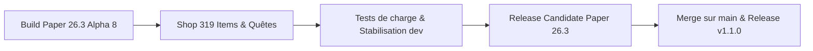

# Suivi & Feuille de route Paper 26.3

Suivez en temps réel l'avancée des travaux, les améliorations apportées et la feuille de route de **GensCore** pour **Minecraft 26.3** et **Java 25 LTS**.

::: info Statut du Projet
- **Version cible :** Minecraft 26.3 (Paper Build Alpha 8+)
- **Environnement d'exécution :** Java 25 LTS
- **Branche de travail active :** [`dev`](https://github.com/WilliamBossard/GensCore/tree/dev) & [`main`](https://github.com/WilliamBossard/GensCore/tree/main)
- **Stabilité :** Alpha fonctionnelle avancée en environnement de production / test
:::

---

## Tableau de bord d'avancement

| Composant | Statut | Détails |
| :--- | :---: | :--- |
| **Compatibilité Java 25 LTS** | Terminé | Compilé avec le flag `--release 25` et tests JVM réussis |
| **API Paper 26.3** | Terminé | API mise à jour sur `26.3.build.8-alpha` |
| **Quêtes de Craft (Torches & Multi-craft)** | Terminé | Prise en compte exacte du rendement unitaire vanilla et du shift-click |
| **Boutique Complète (319 Objets & Potions)** | Terminé | 7 catégories, prix équilibrés (marge 25-35%), auto-seeding SQLite & pagination |
| **Remaster Mini-Jeux Web & CoinFlip** | Terminé | RTP Casino ramené à 84%, nouveau jeu CoinFlip 3D, switch admin en direct |
| **Internationalisation (FR & EN)** | Terminé | Traduction intégrale in-game et web de tous les modules |
| **Moteur Brigadier Paper** | Terminé | Migration vers `PaperCommandManager` avec Tab-completion native |
| **Cloud Reflection Patch** | Terminé | Neutralisation du crash `ItemStackParser` lors du boot |
| **Anti Double-Clic Shop** | Terminé | Debounce 500ms par joueur dans le `CustomGuiModule` |
| **Sync Bannissements** | Terminé | Synchronisation SQLite ⟷ `banned-players.json` natif |
| **Crossplay Bedrock (Geyser/Floodgate)** | Blindé | Capture des `Throwable` et isolation Cumulus/Floodgate face aux changements de bytecode 26.3 |
| **Validation Folia Régionale** | Terminé | Élimination de `isPrimaryThread`, callbacks de téléportation asynchrone et décomposition cross-region |

---

## Ce qui a été fait (Modifications récentes)

### 1. Correction du comptage des quêtes de craft (Shift-Click)
* **Problème résolu :** Crafter des lots d'items (par ex. 32 torches en shift-click) ne comptabilisait que 8 items, car l'événement ne rapportait que la quantité brute d'une unité de recette.
* **Correction apportée :** Détection intelligente du nombre maximal d'exécutions possibles dans la matrice de craft (`minIngredients`), bornée par la place restante dans l'inventaire du joueur, et multiplication par le rendement par craft (`yieldPerCraft = 4` pour les torches).

### 2. Boutique survie prête à l'emploi (319 items & Alchimie)
* **Contenu par défaut :** 319 items validés selon les standards de Minecraft 26.3 répartis en 7 catégories claires (`ores`, `farming`, `wood` avec le nouveau Pale Oak, `building`, `mob_drops`, `potions`, `utilities`).
* **Économie anti-abus :** Prix de vente fixés à ~25-35% du prix d'achat, interdisant toute duplication d'argent par rachat/vente ou arbitrages quêtes/métiers.
* **Moteur dynamique :** Auto-seeding automatique dans SQLite au premier lancement si les tables sont vides, pagination GUI de 45 objets par page avec flèches de navigation, et commande `/shop reload`.

### 3. Remaster des Mini-Jeux Web & Nouveau Jeu CoinFlip
* **Rééquilibrage Casino (Machine à sous) :** Le RTP théorique a été ramené à un taux sain de **84%** (4% Jackpot ×5, 8% Gain moyen ×3, 20% Petit gain ×2, 68% Perte), éliminant les abus de duplication de ressources rares.
* **Roue de la fortune :** 8 tranches équiprobables normalisées à 100%.
* **CoinFlip (Pile ou Face) :** Mini-jeu 3D interactif avec rotation de pièce, payout à x1.95, et contrôle en temps réel via le panneau administrateur.

### 4. Résolution du crash au démarrage sur Paper 26.3
* **Problème identifié :** Lors de l'initialisation de `PaperCommandManager`, la bibliothèque sous-jacente Cloud Framework invoquait une classe de réflexion interne (`ItemStackParser$ModernParser`) cherchant les méthodes `asBukkitCopy` et `asCraftMirror` sur les classes internes NMS de Mojang, dont la signature a évolué en 26.3, provoquant un `ExceptionInInitializerError`.
* **Solution apportée :** Remplacement ciblé de la classe `ItemStackParser` dans les sources compilées avec un mécanisme de détection sécurisé et un repli automatique vers `LegacyParser` (100% Bukkit API standard sans injection NMS). Le plugin démarre désormais sans la moindre erreur sur Paper 26.3.

---

## Ce qui est en cours de travail

### 1. Suivi des mises à jour GeyserMC & Floodgate
* Geyser a mis à disposition un build compatible avec le protocole réseau 26.3 (`2.11.3-SNAPSHOT`).
* Floodgate fonctionne sans mise à jour immédiate obligatoire pour la vérification des clés de chiffrement Bedrock, mais des tests de validation approfondis sur les formulaires Cumulus et la transmission des skins sont en cours de réalisation.

### 2. Validation continue des 28 modules intégrés
* Tests d'intégration progressifs de chaque module sous Paper 26.3 :
  - Métiers & Économie (Jobs, Shop, Auction House)
  - Sécurité & Anti-Exploit (Verrouillage coffres/shulkers, anti-duplication)
  - Mini-jeux & Événements (Pinata, Boss bar, Loterie, CoinFlip)
  - Bot Discord & Serveur Web Javalin 7.2

---

## Feuille de route (Prochaines étapes)

1. **Phase 1 (Actuelle) :** Stabilisation sur la branche `dev` avec Paper 26.3 Build 8-alpha et boutique complète.
2. **Phase 2 :** Validation des tests de stress (50+ joueurs simulés avec profilage Spark).
3. **Phase 3 :** Sortie de la Release Candidate (RC) Paper 26.3.
4. **Phase 4 :** Fusion sur la branche `main` et publication du package officiel GensCore v1.1.0.

---

## Historique des patchs récents

### Patch 26.3-alpha.8 (17 Septembre 2026)
- **API Paper :** Mise à jour vers `26.3.build.8-alpha`.
- **Quêtes de Craft :** Résolution du bug de Shift-Click et prise en compte du rendement batch vanilla (32 torches comptabilisées).
- **Boutique :** Configuration intégrale de 319 objets vanilla (ores, farming, wood avec Pale Oak, building, mob drops, potions, utilities), marge 25-35%, auto-seeding SQLite et pagination GUI 45 slots.
- **Mini-Jeux Web :** Rééquilibrage machine à sous à 84% RTP, roue normalisée, ajout du jeu CoinFlip 3D et interrupteur admin web.
- **Traductions :** Prise en charge intégrale bilingue FR/EN in-game et web.

### Patch 26.3-alpha.7 (16 Septembre 2026)
- **Compatibilité Folia :** Résolution du crash provoqué par `Bukkit.isPrimaryThread()` dans `EconomyModule`, assurant des transactions 100% thread-safe sur les schedulers régionaux Folia.
- **Résilience Geyser / Floodgate :** Blindage de `BedrockSkinModule` et `BedrockFormManager` avec capture de `Throwable` pour neutraliser les `LinkageError` et `NoClassDefFoundError` durant la transition vers 26.3.
- **Initialisation BDD Dynamique :** Correction de `ModuleManager` pour garantir l'exécution de `initDatabase()` lors de l'activation à chaud d'un module en jeu ou via le panel Web.
- **Téléportation Asynchrone :** Prise en compte du callback `CompletableFuture<Boolean>` dans `TeleportUtil` pour confirmer le déplacement effectif du joueur.
- **Workflow CI/CD :** Spécification exacte de `Paper 26.3.build.6-alpha` et de la compatibilité de branche dans les métadonnées de release GitHub.

### Patch 26.3-alpha.6 (16 Septembre 2026)
- **Paper API :** Mise à niveau vers l'API Paper `26.3.build.6-alpha`.
- **Web Panel :** Masquage automatique de l'entrée « Mini-Jeux » dans la navigation joueur lorsque le module ou l'ensemble des jeux sont désactivés.
- **Web Panel :** Redirection immédiate vers le tableau de bord principal en cas de tentative d'accès direct à une route de jeu désactivée.
- **Traductions :** Ajout de la description française et anglaise du module `bedrockskin` et sécurisation des clés de traduction.
