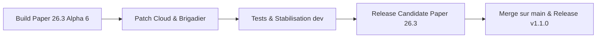

# Suivi & Feuille de route Paper 26.3

Suivez en temps réel l'avancée des travaux, les améliorations apportées et la feuille de route de **GensCore** pour **Minecraft 26.3** et **Java 25 LTS**.

::: info Statut du Projet
- **Version cible :** Minecraft 26.3 (Paper Build Alpha 5+)
- **Environnement d'exécution :** Java 25 LTS
- **Branche de travail active :** [`dev`](https://github.com/WilliamBossard/GensCore/tree/dev)
- **Stabilité :** Alpha fonctionnelle en environnement de test
:::

---

## Tableau de bord d'avancement

| Composant | Statut | Détails |
| :--- | :---: | :--- |
| **Compatibilité Java 25 LTS** | Terminé | Compilé avec le flag `--release 25` et tests JVM réussis |
| **API Paper 26.3** | Terminé | API mise à jour sur `26.3.build.5-alpha` |
| **Moteur Brigadier Paper** | Terminé | Migration vers `PaperCommandManager` avec Tab-completion native |
| **Cloud Reflection Patch** | Terminé | Neutralisation du crash `ItemStackParser` lors du boot |
| **Anti Double-Clic Shop** | Terminé | Debounce 500ms par joueur dans le `CustomGuiModule` |
| **Sync Bannissements** | Terminé | Synchronisation SQLite ⟷ `banned-players.json` natif |
| **Crossplay Bedrock (Geyser/Floodgate)** | En cours | Suivi des builds Geyser 2.11+ et Floodgate pour 26.3 |
| **Validation Folia Régionale** | Prévu | Benchmarks multithread avec FoliaLib sous charge |

---

## Ce qui a été fait (Modifications récentes)

### 1. Résolution du crash au démarrage sur Paper 26.3
* **Problème identifié :** Lors de l'initialisation de `PaperCommandManager`, la bibliothèque sous-jacente Cloud Framework invoquait une classe de réflexion interne (`ItemStackParser$ModernParser`) cherchant les méthodes `asBukkitCopy` et `asCraftMirror` sur les classes internes NMS de Mojang, dont la signature a évolué en 26.3, provoquant un `ExceptionInInitializerError`.
* **Solution apportée :** Remplacement ciblé de la classe `ItemStackParser` dans les sources compilées avec un mécanisme de détection sécurisé et un repli automatique vers `LegacyParser` (100% Bukkit API standard sans injection NMS). Le plugin démarre désormais sans la moindre erreur sur Paper 26.3.

### 2. Autocomplétion et visibilité des commandes (Brigadier natif)
* **Amélioration :** Les commandes d'authentification (`/login`, `/register`, `/changepassword`, `/resetpassword`) ainsi que l'ensemble des modules exploitent le mapping `PaperCommandManager` natif.
* **Résultat :** Les joueurs non connectés ou sans permissions d'administrateur voient désormais les commandes dans l'autocomplétion Tab sans faux avertissement « Commande inconnue » du client Minecraft moderne.
* **Suggestions enrichies :** Intégration de suggestions asynchrones pour la liste des joueurs en ligne (`onlinePlayers`), les entités de générateurs (`spawnerTypes`) et les montants d'économie (`prices`).

### 3. Synchronisation native de la liste des bannissements
* **Problème résolu :** Auparavant, un joueur banni via le panel web ou les commandes restait inscrit en base de données mais disparaissait de la liste visuelle native du serveur après un redémarrage.
* **Correction :** Implémentation d'une synchronisation directe avec le gestionnaire de bans natif de Minecraft (`Bukkit.getBanList(BanList.Type.NAME)`). La base de données SQLite et le fichier `banned-players.json` restent parfaitement cohérents.

### 4. Debounce anti-double achat dans la boutique GUI
* **Amélioration :** Ajout d'une protection temporelle (debounce de 500 ms) par joueur lors des clics dans les interfaces graphiques marchandes (`CustomGuiModule`).
* **Résultat :** Les clics multiples involontaires ou les micro-lags client n'entraînent plus de double débit d'argent ni de double réception d'articles.

---

## Ce qui est en cours de travail

### 1. Suivi des mises à jour GeyserMC & Floodgate
* Geyser a mis à disposition un build compatible avec le protocole réseau 26.3 (`2.11.3-SNAPSHOT`).
* Floodgate fonctionne sans mise à jour immédiate obligatoire pour la vérification des clés de chiffrement Bedrock, mais des tests de validation approfondis sur les formulaires Cumulus et la transmission des skins sont en cours de réalisation.

### 2. Validation continue des 28 modules intégrés
* Tests d'intégration progressifs de chaque module sous Paper 26.3 :
  - Métiers & Économie (Jobs, Shop, Auction House)
  - Sécurité & Anti-Exploit (Verrouillage coffres/shulkers, anti-duplication)
  - Mini-jeux & Événements (Pinata, Boss bar, Loterie)
  - Bot Discord & Serveur Web Javalin 7.2

---

## Feuille de route (Prochaines étapes)

1. **Phase 1 (Actuelle) :** Stabilisation sur la branche `dev` avec Paper 26.3 Build 6-alpha.
2. **Phase 2 :** Validation des tests de stress (50+ joueurs simulés avec profilage Spark).
3. **Phase 3 :** Sortie de la Release Candidate (RC) Paper 26.3.
4. **Phase 4 :** Fusion sur la branche `main` et publication du package officiel GensCore v1.1.0.

---

## Historique des patchs récents

### Patch 26.3-alpha.6 (16 Septembre 2026)
- **Paper API :** Mise à niveau vers l'API Paper `26.3.build.6-alpha`.
- **Web Panel :** Masquage automatique de l'entrée « Mini-Jeux » dans la navigation joueur lorsque le module ou l'ensemble des jeux sont désactivés.
- **Web Panel :** Redirection immédiate vers le tableau de bord principal en cas de tentative d'accès direct à une route de jeu désactivée.
- **Traductions :** Ajout de la description française et anglaise du module `bedrockskin` et sécurisation des clés de traduction.

### Patch 26.3-alpha.5 (16 Septembre 2026)
- **Fix :** Contournement résilient des erreurs de réflexion dans Cloud `ItemStackParser` sur Paper 26.3.
- **Sécurité :** Protection anti-rebond dans les menus GUI de la boutique marchande.
- **Modération :** Synchronisation bidirectionnelle native des bannissements avec `banned-players.json`.
- **Performance :** Optimisation du cycle de build Maven avec Shade Plugin 3.6.2 et ASM 9.10.1 pour Java 25.

### Patch 26.3-alpha.4 (15 Septembre 2026)
- **Nouveauté :** Adoption de l'API Paper `26.3.build.5-alpha`.
- **Commandes :** Migration vers l'orchestrateur de commandes moderne `PaperCommandManager`.
- **Web Panel :** Compatibilité Javalin 7.2 confirmée sous runtime Java 25.
