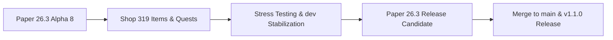

# Paper 26.3 Migration Tracker & Roadmap

Follow real-time progress, newly deployed improvements, and the transition roadmap of **GensCore** towards **Minecraft 26.3** and **Java 25 LTS**.

::: info Project Status
- **Target Engine:** Minecraft 26.3 (Paper Build Alpha 16+)
- **Runtime Environment:** Java 25 LTS
- **Active Working Branch:** [`dev`](https://github.com/WilliamBossard/GensCore/tree/dev) & [`main`](https://github.com/WilliamBossard/GensCore/tree/main)
- **Stability:** Advanced functional Alpha in testing & staging
:::

---

## Progress Dashboard

| Component | Status | Details |
| :--- | :---: | :--- |
| **Java 25 LTS Support** | Completed | Compiled with `--release 25` flag and verified on Temurin JVM 25 |
| **Paper 26.3 API** | Completed | API dependency upgraded to `26.3.build.16-alpha` |
| **Craft Quests (Torches & Bulk Crafting)** | Completed | Accurate shift-click batch size tracking and vanilla yield multiplier |
| **Comprehensive Shop (319 Items & Potions)** | Completed | 7 balanced categories (25-35% margin), SQLite auto-seeding & GUI pagination |
| **Web Minigames Remaster & CoinFlip** | Completed | Slot machine RTP calibrated to 84%, 3D animated CoinFlip, real-time admin switches |
| **Internationalization (FR & EN)** | Completed | Complete dual-language support for all in-game and web features |
| **Native Paper Brigadier** | Completed | Migrated to `PaperCommandManager` with full native Tab-completion |
| **Cloud Reflection Patch** | Completed | Fixed startup crash in `ItemStackParser` caused by NMS changes |
| **Shop Anti-Double Click** | Completed | Implemented 500ms per-player debounce filter in `CustomGuiModule` |
| **Banlist Synchronization** | Completed | Full bidirectional sync between SQLite and native `banned-players.json` |
| **Bedrock Cross-Play (Geyser/Floodgate)** | Hardened | Catching `Throwable` across Cumulus forms & skin API against 26.3 linkage mismatches |
| **Folia Regional Threading** | Completed | Eliminated `isPrimaryThread` exceptions, added async teleport callbacks & cross-region decay |

---

## Completed Work & Improvements

### 1. Shift-Click Craft Quest Accounting
* **Issue Addressed:** Bulk crafting recipes yielding multiple items per operation (such as 32 torches via shift-click) previously only awarded 8 count progress due to event result unit reporting.
* **Resolution:** Implemented matrix ingredient inspection (`minIngredients`), inventory storage capacity bounds checking, and batch multiplication using recipe yield (`yieldPerCraft = 4` for torches).

### 2. Turnkey Survival Shop (319 Items & Alchemy)
* **Default Database:** 319 fully balanced survival items spanning 7 distinct categories (`ores`, `farming`, `wood` including 26.3 Pale Oak, `building`, `mob_drops`, `potions`, `utilities`).
* **Economic Safety:** Sell prices strictly calibrated between 25% and 35% of buy prices to eliminate circular arbitrage exploits with jobs and quests.
* **Dynamic Engine:** SQLite auto-seeding on fresh database initialization, dynamic 45-item pagination GUI with previous/next arrows, and in-game `/shop reload` command.

### 3. Web Minigames Remaster & 3D CoinFlip
* **Slot Machine Rebalance:** Returned RTP to a sustainable **84%** (4% Jackpot ×5, 8% Medium ×3, 20% Small ×2, 68% Loss), protecting server economies from item inflation.
* **Wheel of Fortune:** 8 equal slices normalized to 100%.
* **Interactive CoinFlip:** 3D flipping coin animation, x1.95 payout multiplier, and live admin toggles.

### 4. Paper 26.3 Startup Crash Resolution
* **Identified Cause:** During `PaperCommandManager` initialization, the shaded Cloud Command Framework eagerly invoked reflection on Mojang NMS classes (`ItemStackParser$ModernParser`) looking for `asBukkitCopy` and `asCraftMirror` methods. Minecraft 26.3 internal refactorings caused this to throw `ExceptionInInitializerError`.
* **Resolution:** Replaced `ItemStackParser` with a resilient implementation featuring safe fallback detection to `LegacyParser` (100% standard Bukkit API without any fragile NMS reflection). GensCore now starts instantaneously on Paper 26.3.

---

## In-Progress Efforts

### 1. GeyserMC & Floodgate Monitoring
* GeyserMC has rolled out initial 26.3 protocol updates (`2.11.3-SNAPSHOT`).
* Floodgate Bedrock authentication and Cumulus form dialogs are undergoing compatibility validation to ensure seamless crossplay without requiring manual re-encryption key regeneration.

### 2. Full Regression Testing across 28 Modules
* Systematic validation of all core modules running under Paper 26.3:
  - Economy & Jobs (Dynamic pricing shop, Player Auction House)
  - Security & Anti-Exploit (Shulker protection, container locks)
  - Interactive Events (Pinata, Boss bars, Lottery, CoinFlip)
  - Discord Bot integration & Javalin 7.2 Web Server

---

## Roadmap & Next Milestones

1. **Phase 1 (Current):** Stabilization on the `dev` branch on Paper 26.3 Build 16-alpha with complete shop.
2. **Phase 2:** High-concurrency stress testing (50+ simulated players with Spark profiling).
3. **Phase 3:** Paper 26.3 Release Candidate (RC) release verification.
4. **Phase 4:** Merge `dev` into `main` and publish the official GensCore v1.1.0 distribution.

---

## Recent Patch Notes

### Patch 26.3-alpha.16 (September 18, 2026)
- **Paper API:** Upgraded to `26.3.build.16-alpha` (latest official PaperMC release).
- **Player Balance Wallet:** Added live balance card directly in the sidebar under player profile with instant debit/credit animations (`+`/`-`) and on-click sync.
- **Shop Balance Security:** Real-time post-purchase balance calculation in shop drawer with warning alert and automatic purchase blocking when funds are insufficient.
- **100% 26.3 Texture Coverage:** Full asset mapping for all 1,815 Minecraft 26.3 materials (Vanilla spears, Poplar wood set, 16 cushions, shelf mushroom, straw bed, copper blocks) with resilient fallback chains.
- **CI/CD Release Workflow:** Updated GitHub release pipeline to target `Paper 26.3.build.16-alpha`.

### Patch 26.3-alpha.8 (September 17, 2026)
- **Paper API:** Bumped to `26.3.build.8-alpha`.
- **Craft Quests:** Resolved Shift-Click recipe progress reporting to accurately track multi-item yields (e.g. 32 torches).
- **Survival Shop:** Complete 319-item catalog across 7 categories (ores, farming, wood with Pale Oak, building, mob drops, potions, utilities), SQLite auto-seeding, 45-slot pagination GUI, and `/shop reload`.
- **Web Minigames:** Rebalanced slot machine to 84% RTP, normalized Wheel of Fortune, added 3D CoinFlip game with admin toggle.
- **Localization:** 100% bilingual English/French translation coverage in-game and on the web portal.

### Patch 26.3-alpha.7 (September 16, 2026)
- **Folia Thread Safety:** Resolved Folia crash caused by `Bukkit.isPrimaryThread()` in `EconomyModule`, making economy transactions fully safe on Folia regional schedulers.
- **Geyser / Floodgate Resilience:** Hardened `BedrockSkinModule` and `BedrockFormManager` with `Throwable` exception handlers to catch JVM `LinkageError` and `NoClassDefFoundError` during the 26.3 transition.
- **Database & Modules:** Fixed `ModuleManager` dynamic module toggling to ensure `initDatabase()` is called when a module is activated at runtime.
- **Teleportation:** Added `CompletableFuture<Boolean>` confirmation handling to `TeleportUtil` for asynchronous regional teleports.
- **CI/CD Workflow:** Updated release workflow compatibility specifications to explicitly state `Paper 26.3.build.6-alpha` and backward-compatible branch support.

### Patch 26.3-alpha.6 (September 16, 2026)
- **Paper API:** Upgraded Paper API to `26.3.build.6-alpha`.
- **Web Panel:** Dynamically hide the "Mini-Jeux" item in player navigation when the module or all games are disabled.
- **Web Panel:** Automatic redirection to dashboard if a player tries to navigate to a disabled mini-games route.
- **Translations:** Added missing BedrockSkin module descriptions in English and French, securing fallback keys.
