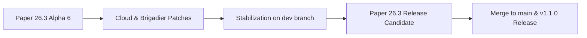

# Paper 26.3 Migration Tracker & Roadmap

Follow real-time progress, newly deployed improvements, and the transition roadmap of **GensCore** towards **Minecraft 26.3** and **Java 25 LTS**.

::: info Project Status
- **Target Engine:** Minecraft 26.3 (Paper Build Alpha 5+)
- **Runtime Environment:** Java 25 LTS
- **Active Working Branch:** [`dev`](https://github.com/WilliamBossard/GensCore/tree/dev)
- **Stability:** Functional Alpha in testing stage
:::

---

## Progress Dashboard

| Component | Status | Details |
| :--- | :---: | :--- |
| **Java 25 LTS Support** | Completed | Compiled with `--release 25` flag and verified on Temurin JVM 25 |
| **Paper 26.3 API** | Completed | API dependency upgraded to `26.3.build.5-alpha` |
| **Native Paper Brigadier** | Completed | Migrated to `PaperCommandManager` with full native Tab-completion |
| **Cloud Reflection Patch** | Completed | Fixed startup crash in `ItemStackParser` caused by NMS changes |
| **Shop Anti-Double Click** | Completed | Implemented 500ms per-player debounce filter in `CustomGuiModule` |
| **Banlist Synchronization** | Completed | Full bidirectional sync between SQLite and native `banned-players.json` |
| **Bedrock Cross-Play (Geyser/Floodgate)** | In Progress | Tracking Geyser 2.11+ builds and Floodgate validation for 26.3 |
| **Folia Regional Threading** | Planned | Multi-threaded performance benchmarks with FoliaLib under load |

---

## Completed Work & Improvements

### 1. Paper 26.3 Startup Crash Resolution
* **Identified Cause:** During `PaperCommandManager` initialization, the shaded Cloud Command Framework eagerly invoked reflection on Mojang NMS classes (`ItemStackParser$ModernParser`) looking for `asBukkitCopy` and `asCraftMirror` methods. Minecraft 26.3 internal refactorings caused this to throw `ExceptionInInitializerError`.
* **Resolution:** Replaced `ItemStackParser` with a resilient implementation featuring safe fallback detection to `LegacyParser` (100% standard Bukkit API without any fragile NMS reflection). GensCore now starts instantaneously on Paper 26.3.

### 2. Command Autocompletion & Visibility (Native Brigadier)
* **Improvement:** Authentication commands (`/login`, `/register`, `/changepassword`, `/resetpassword`) and module commands are routed directly through modern Paper Brigadier mappings.
* **Result:** Unauthenticated players or players without operator privileges now see commands in Tab suggestions cleanly without "Unknown command" warnings from the modern client.
* **Dynamic Providers:** Added asynchronous tab-completion providers for online players (`onlinePlayers`), spawner mob types (`spawnerTypes`), and economy amounts (`prices`).

### 3. Native Banlist Persistence
* **Issue Addressed:** Players banned through the Web Panel or command interface remained registered in the SQLite database but were occasionally missing from the native server ban table following a server restart.
* **Fix:** Implemented bidirectional synchronization directly into Minecraft's native ban manager (`Bukkit.getBanList(BanList.Type.NAME)`), keeping both `banned-players.json` and SQLite in continuous sync.

### 4. Anti-Double Purchase Debounce in Shop GUI
* **Improvement:** Added an automatic temporal debounce window (500 ms) per player in `CustomGuiModule`.
* **Result:** High-frequency clicks or latency spikes no longer trigger unintended double debits or duplicate inventory items.

---

## In-Progress Efforts

### 1. GeyserMC & Floodgate Monitoring
* GeyserMC has rolled out initial 26.3 protocol updates (`2.11.3-SNAPSHOT`).
* Floodgate Bedrock authentication and Cumulus form dialogs are undergoing compatibility validation to ensure seamless crossplay without requiring manual re-encryption key regeneration.

### 2. Full Regression Testing across 28 Modules
* Systematic validation of all core modules running under Paper 26.3:
  - Economy & Jobs (Dynamic pricing shop, Player Auction House)
  - Security & Anti-Exploit (Shulker protection, container locks)
  - Interactive Events (Pinata, Boss bars, Lottery)
  - Discord Bot integration & Javalin 7.2 Web Server

---

## Roadmap & Next Milestones

1. **Phase 1 (Current):** Stabilization on the `dev` branch on Paper 26.3 Build 6-alpha.
2. **Phase 2:** High-concurrency stress testing (50+ simulated players with Spark profiling).
3. **Phase 3:** Paper 26.3 Release Candidate (RC) release verification.
4. **Phase 4:** Merge `dev` into `main` and publish the official GensCore v1.1.0 distribution.

---

## Recent Patch Notes

### Patch 26.3-alpha.6 (September 16, 2026)
- **Paper API:** Upgraded Paper API to `26.3.build.6-alpha`.
- **Web Panel:** Dynamically hide the "Mini-Jeux" item in player navigation when the module or all games are disabled.
- **Web Panel:** Automatic redirection to dashboard if a player tries to navigate to a disabled mini-games route.
- **Translations:** Added missing BedrockSkin module descriptions in English and French, securing fallback keys.

### Patch 26.3-alpha.5 (September 16, 2026)
- **Fix:** Defended against Cloud `ItemStackParser` reflection errors on Paper 26.3.
- **Security:** Debounce filter added to shop GUI click transactions.
- **Moderation:** Bidirectional synchronization of bans with native `banned-players.json`.
- **Build:** Optimized Maven shade and compiler configuration with ASM 9.10.1 for Java 25.

### Patch 26.3-alpha.4 (September 15, 2026)
- **Upgrade:** Upgraded Paper API to `26.3.build.5-alpha`.
- **Commands:** Shifted to modern `PaperCommandManager` architecture.
- **Web Panel:** Verified Javalin 7.2 runtime compatibility on Java 25.
